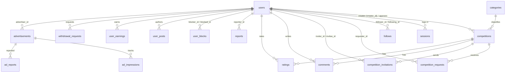

# 02 — قاعدة البيانات (D1/SQLite)

> المحرك: Cloudflare D1. الترحيلات في `migrations/` وتُطبق بـ
> `npm run db:migrate:local` (محلي) أو `wrangler d1 migrations apply dueli-db`
> (بعيد). الطبقة البرمجية: `src/models/*` فوق `BaseModel`.

## تاريخ الترحيلات (0001 → 0018)

> ⚠️ تكرار ترقيم تاريخي: يوجد ملفّان باسم `0012` (`0012_reports_ad_target.sql`
> و`0012_rate_limits.sql`). لا تُعِد الترقيم ولا تحذف — التفاصيل في
> `docs/16-KNOWN-ISSUES.md`.

| # | الملف | ماذا يفعل |
|---|-------|-----------|
| 0001 | `0001_initial_schema.sql` | كل الجداول الأساسية: `users`, `categories`, `competitions`, `competition_invites`, `competition_requests`, `competition_invitations`, `ratings`, `comments`, `follows`, `notifications`, `posts`, `post_likes`, `messages`, `scheduled_competitions`, `countries`, `sessions`, `likes`, `reports`, `conversations`, `advertisements`, `ad_impressions`, `user_earnings`, `user_settings`, `user_posts`, `competition_reminders`, `dislikes`, `signaling_rooms`, `signaling_signals`, `chunk_keys`, `ad_blocks`, `donations`, `withdrawal_requests`, `payment_methods`, `user_blocks`, `watch_history`, `user_keywords`, `watch_later` |
| 0002 | `0002_transparency_ledger.sql` | محرك الشفافية: `platform_financial_logs` (+ ملخصات/مشاهد) |
| 0003 | `0003_admin_ads_arbitration_livefinance.sql` | أدوار الإدارة وسجلات التدقيق، أعمدة المعلنين في `advertisements`، حقول التحكيم في `reports` (`assigned_admin_id`, `arbitration_*`, `resolved_at`)، جداول الإيرادات الحية |
| 0004 | `0004_matchmaking_fixes.sql` | `users.is_online/last_seen_at/is_busy`، جدول `user_blocks`، قيد فريد على الدعوات |
| 0005 | `0005_withdrawals_sse_suspend.sql` | تعزيز `withdrawal_requests` (`approved_by`, `rejection_reason`)، جداول SSE/التعليق الإداري |
| 0006 | `0006_recommendations_lifecycle.sql` | `user_hidden_competitions` + أعمدة دورة حياة المنافسات |
| 0007 | `0007_schema_alignment.sql` | `users.elo_rating` (+ فهرس)، `current_competition_id`/`busy_since` — مطابقة الكود الذي كان يقرأ أعمدة غير موجودة |
| 0008 | `0008_allow_requests.sql` | `user_settings.allow_requests` (خصوصية استقبال الطلبات) |
| 0009 | `0009_account_deletion.sql` | حذف الحساب (GDPR): `users.deleted_at/deletion_reason` + إخفاء هوية المنشئ/المعلق |
| 0010 | `0010_missing_columns.sql` | `competition_requests.expires_at/updated_at`، `competition_invitations.expires_at/updated_at`، `competitions.accepted_at` + backfill (+24h) — كانت `createRequest/createInvitation` تفشل بـ "no such column" |
| 0011 | `0011_fix.sql` | `competition_invitations.accepted_at` + backfill من `updated_at`/`created_at` للصفوف المقبولة |
| 0012 | `0012_reports_ad_target.sql` **و** `0012_rate_limits.sql` (اسمان متكرران — انظر التنبيه أعلاه) | إعادة بناء `reports` للسماح بـ `target_type='ad'` (بلاغات إعلانات غرفة البث) — مع الحفاظ على أعمدة 0003 **+** جدول `rate_limits` (عدّادات حدّ المعدل الموزعة، SEC-12) |
| 0013 | `0013_chunk_key_binding.sql` | ربط مفاتيح الرفع: `chunk_keys.user_id` + `expires_at` (10 دقائق) + فهارس — مع المفاتيح العشوائية آمنة التشفير في `chunks/routes.ts` (SEC-06) |
| 0014 | `0014_messages_conversation_alignment.sql` | محاذاة `messages` مع نموذج المحادثات: `conversation_id` (FK→conversations) + `read_at` + backfill المحادثات legacy + فهارس `(conversation_id, created_at)` و`(receiver_id, is_read)` |
| 0015 | `0015_content_length_bounds.sql` | حدود الطول عبر triggers (لا إعادة بناء مدمّرة): تعليق ≤ 2000 حرف / رسالة ≤ 4000 حرف (`ContentTooLongError` في طبقة النموذج قبل الإدراج) |
| 0016 | `0016_comments_soft_delete.sql` | حذف ناعم للتعليقات: `deleted_at` + فهرسا `(competition_id, deleted_at)` و`(parent_id, deleted_at)` |
| 0017 | `0017_ratings_competition_competitor_idx.sql` | فهرس `ratings(competition_id, competitor_id)` لملخص التقييمات والسحب |
| 0018 | `0018_competitions_elo_applied_at.sql` | عمود `competitions.elo_applied_at` لمطالبة idempotency حسم ELO داخل SQL (B12) |

## ERD (العلاقات الأساسية)

## ملاحظات حرجة

- **CHECK constraints لا تُعدَّل في SQLite/D1**: أي توسيع لقيم `CHECK`
  (مثل `reports.target_type`) يتطلب إعادة بناء الجدول (انظر 0012 كنموذج).
- **`users.email_verified` عمود ميت**: موجود في 0001 لكن لا شيء يقرؤه؛
  الحالة الفعلية هي `users.is_verified`. لا تستخدمه في كود جديد.
- **كلمات `datetime('now')`**: D1 يرفض `ADD COLUMN` بقيمة افتراضية
  غير ثابتة — الأعمدة الجديدة nullable مع backfill، والكود يكتبها صراحةً.
- **الجلسات**: `sessions.id` نص UUID، تنتهي بعد 30 يوماً
  (`SessionModel.create`). المستخدم المحظور (`is_active=0`) تُمسح جلساته فوراً.
## سياسة التوزيع المالية (8.B)

> المصادر canonical للسياسة: `migrations/0003` (يSeed `platform_share_percentage=20`)،
> `src/models/PlatformSettingsModel.ts::getPlatformSharePercentage()`، و`src/lib/services/LivePayoutEngine.ts`
> (تعليق العلوي). لا توجد نسبة 70/25/5 في أي مصدر فعلي.

- **نسبة المنصة**: 20% من إجمالي أرباح الإعلانات (قابلة للتعديل عبر `platform_settings.platform_share_percentage`، الافتراضي 20).
- **مجموع المتنافسين (competitor pool)**: 80% المتبقية تُقسَّم بين المنشئ والخصم حسب نسبة متوسط تقييمات المشاهدين لكل منهما.
- **التعادل/غياب التقييمات**: إذا كان مجموع التقييمات صفراً (لا تقييمات أو تعادل تام)، يُقسَّم الـpool بالتساوي بين المتنافسين.
- **التقريب**: جميع الحسابات بـ integer cents (لا FLOAT/REAL). عند وجود باقٍ من القسمة، يُوزَّع deterministically: المنصة أولاً، ثم صاحب التقييم الأعلى، ثم الآخر. مجموع الحصص = المبلغ الأصلي بالضبط.
- **المصدر الحقيقى للمال**: `ledger_entries` (8.A) فقط. `CompetitionRevenueLog` سجل لقطة للتدقيق (audit snapshot) وليس مصدراً مالياً.
