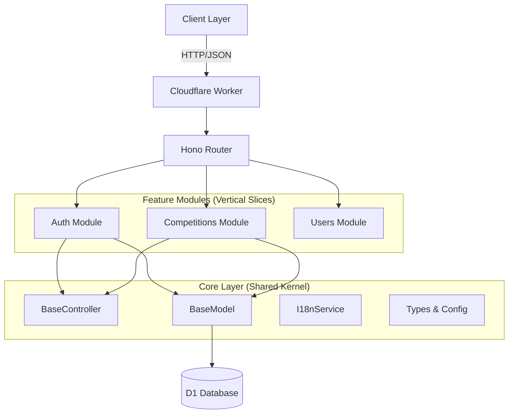

# Architecture & Patterns

## High-Level Architecture
Dueli adopts a **Vertical Slice** architecture with a strong shared kernel. This allows features (Auth, Competitions, Users) to be independent while sharing core infrastructure (Database, HTTP, i18n).

## Request Flow
A typical request (e.g., "Create Competition") flows through these layers:

1.  **Hono Route**: Matches URL `/api/competitions`, applies `authMiddleware`.
2.  **Controller**: `CompetitionController` extends `BaseController`.
    *   Validates input.
    *   Checks context (User, Language).
3.  **Service/Logic**: Logic is often directly in the Controller for simple CRUD, or a dedicated Service for complex flows (like OAuth).
4.  **Model**: `CompetitionModel` extends `BaseModel`.
    *   Executes `this.db.prepare(...)` to run secure, parameterized SQL.
5.  **Database**: Cloudflare D1 executes the query at the edge.

## Core Design Patterns

### 1. Universal Language Architecture
The platform is designed to be language-agnostic.
- **Type Definition**: `type Language = string` (accepts any ISO code).
- **Graceful Fallback**: The `I18nService` checks if a translation exists. If not (e.g., user is `fr`), it falls back to `en` automatically without error.
- **Data Layer**: The database stores flexible `name_en`, `name_ar` but is extensible. `Category` slugs are used as universal keys.

### 2. The Thin Model Pattern
Located in `src/models/base/BaseModel.ts`.
Models are NOT "Active Records". They are closer to **Data Access Objects (DAOs)**.
- They do not hold state.
- They are instantiated per request with the database binding.
- **Why?** serverless environments (Workers) are stateless. A stateless DAO pattern fits perfectly.

### 3. Factory Pattern for OAuth
The `OAuthProviderFactory` (`src/lib/oauth/OAuthProviderFactory.ts`) creates the correct provider (Google, Facebook, etc.) based on the string name. This allows adding new providers without touching the auth controller logic.

## Technical Decisions Analysis

### Why Hono?
- **Speed**: Fastest standard router for Cloudflare Workers.
- **Types**: First-class TypeScript support sharing types between client and server.

### Why No ORM (Prisma/Drizzle)?
- **Performance**: D1 is fast, but ORMs add overhead. The `BaseModel` provides 80% of ORM utility (typing, basic CRUD) with 0% runtime overhead.
- **Bundle Size**: Important for Edge Workers.

### Why Vertical Slices?
- **Maintenance**: Splitting by feature (`modules/competitions`, `modules/users`) makes it easier to navigate than splitting by technical layer (`controllers/`, `models/`).
- **Scalability**: New features can be added without modifying existing core files.