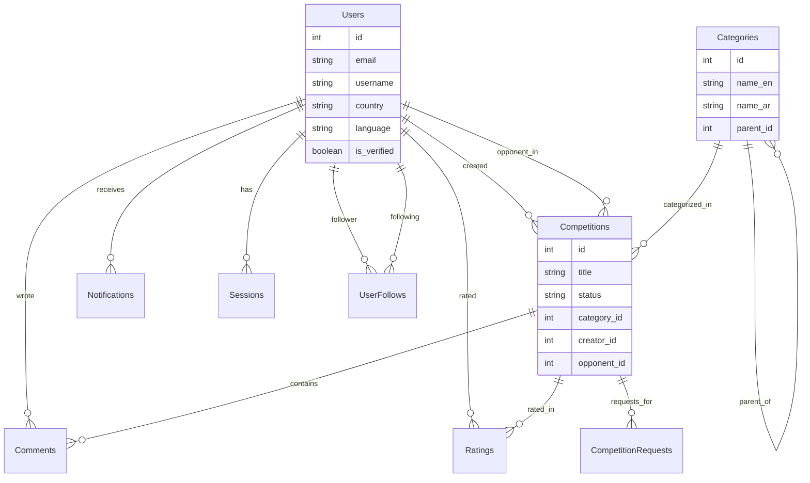

# Database Documentation & Schema

## Overview
Dueli uses **Cloudflare D1**, a serverless SQLite database, chosen for its global distribution and low latency. The database interaction is managed through a lightweight custom ORM layer (`BaseModel`) rather than a heavy third-party ORM, ensuring maximum performance and control.

## Entity Relationship Diagram (ERD)

## Schema Details

### 1. Users Table
Stores user profile, authentication, and stats.
- **Key Fields**: `email` (Unique), `username` (Unique), `oauth_provider` (for Social Login).
- **Stats**: `total_wins`, `total_competitions`, `average_rating` are denormalized for performance.

### 2. Competitions Table
The core entity representing a debate or competition.
- **Relationships**: 
    - `creator_id`: The user who started it.
    - `opponent_id`: The challenger (nullable until accepted).
    - `category_id`: The topic category.
- **States**: `pending` → `accepted` → `live` → `completed` (or `cancelled`).
- **Live Data**: `youtube_live_id` stores the connection to the live stream.

### 3. Categories Table
Support for nested categories (e.g., Science -> Physics).
- **Hierarchy**: Uses `parent_id` self-reference.
- **I18n**: Stores `name_ar` and `name_en` directly in the database for instant localization without joining translation tables.

### 4. Interactions
- **Comments**: Linked to `competition_id`. Supports live chat during streams.
- **Ratings**: Users rate each other after a competition.
- **CompetitionRequests**: Manages the "Lobby" logic where users request to join a pending competition.

## Data Management Strategy

### Custom ORM (`BaseModel`)
Located in `src/models/base/BaseModel.ts`.
- **Wraps D1**: Provides typed `findById`, `findAll`, `create`, `update` over raw SQL.
- **No N+1**: Encourages explicit joins or parallel fetching rather than lazy loading.

### Seeding Strategy (`seed.sql`)
The project maintains a massive seed file (`seed.sql`) ~150KB.
- **Test Users**: ~20 users with diverse profiles (different countries, languages, verified/unverified).
- **Rich Content**: Hundreds of competitions across all states (Live, Recorded, Pending) to test UI filters.
- **Reality Simulation**: Comments, ratings, and follows are pre-populated to simulate a mature platform, essential for testing the "vibes" and layout logic.
